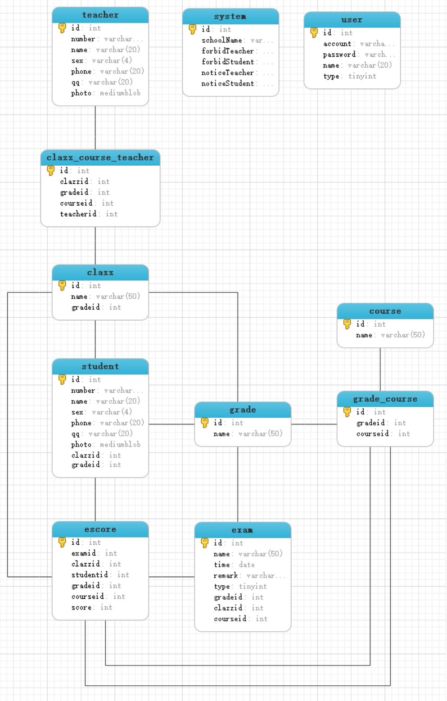
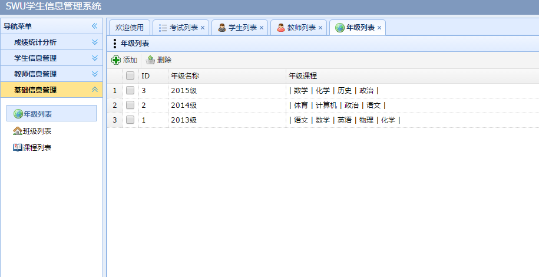

# course-manage-system
jsp servlet mysql实现的学生成绩管理系统  

# 需求分析
&nbsp;&nbsp;&nbsp;&nbsp;&nbsp;&nbsp;&nbsp;&nbsp;该学生信息管理系统涉及到学生、教师、系统管理员、班级、学生成绩、课程。设置一个系统管理员对系统进行管理。所有用户需输入账号、密码登录进入系统；管理员进入系统后可对学生、老师、班级、课程进行增删改查操作；学生进入系统，查看成绩、查看和修改自己的信息；老师进入系统后，对自己这门课程的学生设置课程成绩、查看和修改自己的信息，查看学生的信息和成绩、以及统计分析学生的成绩；
管理员为班级设置年级，为年级设置课程，为班级的每门课程设置老师，为学生设置班级。一个年级有多门课程(语文、数学、外语等等)，班级的每门课程只能有一名老师，一个老师可以有多门课程；老师选择自己这门课程为该课程的学生登记成绩。老师可以查看其他老师的信息(可以当成是老师的通讯录)，查看本课程学生的信息和成绩；学生可以查看班级其他同学的信息(可以看成是班级的同学录)。  
考试分为两种，一种是年级统考，一种是平时考试。年级统考需要管理员事先添加一次年级统考，考试成绩出来后，老师进入系统选择该次考试为学生登记成绩。平时考试则是班级平时的考试，老师添加考试信息，登记成绩。成绩统计分析则是针对年级统考进行分析，主要涉及各学科分数名次，总分名次。

# 表结构设计

# 账号信息
输入用户名和密码访问系统
 用户名：admin  
 密码：111111  

 教师账号：  
	2012 、
	2011、
	2010、
	2009、
	2008、

 学生账号：  
	201301001、
	201302002、
	201401001、
	201402002、  
	
 密码都为：111111  
 # 网站效果展示

